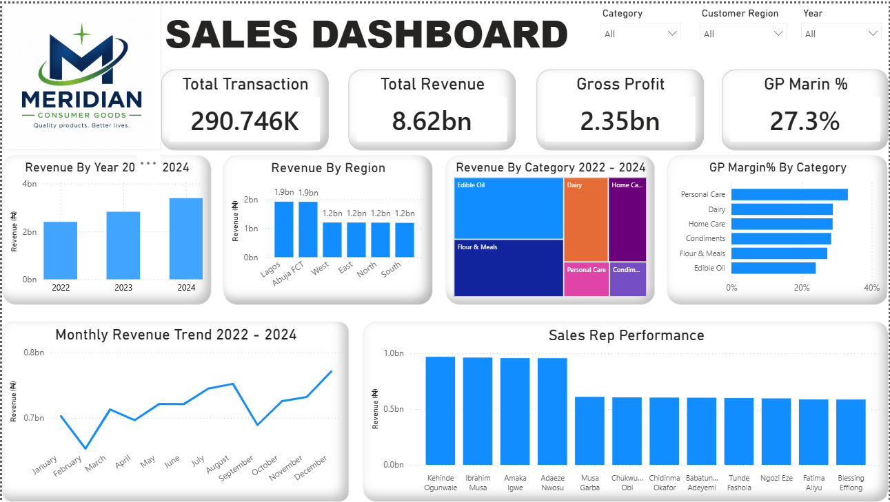
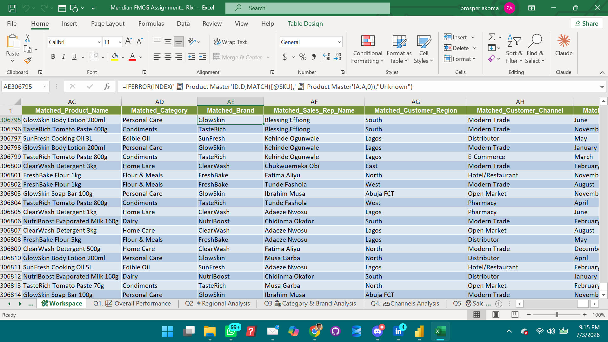

# Meridian Consumer Goods Nigeria Ltd — Sales Performance Analysis (FY2022–2024)

---

## The Story Behind This Project

This project started with a single question a Sales Director might ask on a Monday morning:

> *"How is the business doing — and why?"*

I took a raw, messy AI-generated dataset of over 310,000 FMCG sales transactions 
spanning three years, cleaned it from scratch, enriched it with reference data, 
answered 10 real business questions, and built an interactive Power BI dashboard 
to tell the story visually.

Every step was done manually and deliberately — no shortcuts, no automated cleaning 
tools. Just Excel, Power Query, and a commitment to understanding the data before 
drawing conclusions from it.

---

## Company Background

**Meridian Consumer Goods Nigeria Ltd** is a fictional FMCG company created 
specifically as an AI-generated dataset to test raw capability in both data 
analytics and business analytics. The dataset was designed to mirror real-world 
Nigerian FMCG business conditions, including inflationary pricing, regional 
sales dynamics, trade channel mix, and deliberately introduced data quality 
issues that a real analyst would encounter on the job.

The goal was not just to clean numbers, but to think like a business analyst. 
To ask not just "what does the data say?" but "what does this mean for the 
business, and what should leadership do about it?"

The company distributes products across six categories:
- Edible Oil
- Flour & Meals
- Condiments
- Dairy
- Home Care
- Personal Care

Operating across **6 regions** (Lagos, Abuja FCT, North, South, East, West), 
through **6 trade channels** (Modern Trade, Open Market, Distributor, E-Commerce, 
Pharmacy, Hotel/Restaurant), with **12 field sales representatives** serving 
**360 customers** nationwide.

---

## Dataset

| Property | Detail |
|---|---|
| Transactions | 310,000 raw rows |
| Period | FY2022 – FY2024 |
| Products | 20 SKUs across 6 categories |
| Customers | 360 |
| Sales Reps | 12 |
| Regions | 6 |
| Channels | 6 |

📥 **Download the full Excel workbook here:**
[Meridian Sales Analysis — Google Drive](https://docs.google.com/spreadsheets/d/1nLIa8KSZ56KfpGML-LXD_s2CfBCEdark/edit?usp=sharing&ouid=105575522410222491414&rtpof=true&sd=true)

---

## The Mess I Started With

Real data is never clean. This dataset had 9 intentional quality issues that had 
to be found and fixed before any analysis could begin:

| # | Issue | Frequency |
|---|---|---|
| 1 | Mixed date formats — DD/MM/YYYY, MM-DD-YYYY, YYYY-MM-DD | ~5% of rows |
| 2 | Negative quantities — returns or data entry errors | ~1.5% of rows |
| 3 | Missing Customer IDs and Names | ~2% of rows |
| 4 | Missing SKU codes and product details | ~1.5% of rows |
| 5 | Revenue stored as text with ₦ symbol e.g. ₦1,250.00 | ~2% of rows |
| 6 | Duplicate transactions | ~1% of rows |
| 7 | Inconsistent region spelling — lagos, LAGOS, Lagos | ~1.5% of rows |
| 8 | Missing Sales Rep IDs | ~2% of rows |
| 9 | Zero unit price — data entry errors | ~0.5% of rows |

---

## What I Did — Step by Step

### Step 1 — Data Cleaning (Microsoft Excel)

- Created a working copy — never touched the raw data
- Removed 3,143 duplicate rows using Remove Duplicates
- Standardised all date formats using DATEVALUE, MID, LEFT, and EOMONTH
-
